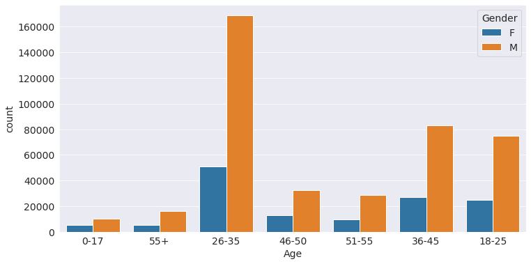

# Let's talk with Black-friday-sales Data

I downloaded black friday sales data from kaggle(https://www.kaggle.com/datasets/sdolezel/black-friday). I used various libraries and modules to make this project eg: Numpy, Pandas, Matplotlib, Seaborn, opendatasets and scipy. 

## Problem Statement
 A retail company ABC Private Limited wants to understand the customer purchese behaviour (specifically purshase amount) against various products of different categories. They have shared purchase summary of various customers for selected high volume products from last month. The dataset also contains customer demographics (Gender, Age, Occupation, City Category, marital status, stay_in_current _city), ,product detalis (product_id and product category) and Total purchase_amount from last month.
Data Overview

-	User_ID: Unique ID of the user.
-	Product_ID: Unique ID of the product.
-	Gender: indicates the gender of the person making the transaction.
-	Age: indicates the age group of the person making the transaction.
-	Occupation: shows the occupation of the user, already labeled with numbers 0 to 20.
-	City_Category: User's living city category. Cities are categorized into 3 different categories 'A', 'B' and 'C'.
-	Stay_In_Current_City_Years: Indicates how long the users has lived in this city.
-	Marital_Status: is 0 if the user is not married and 1 otherwise.
-	Product_Category_1 to _3: Category of the product. All 3 are already labaled with numbers.
-	Purchase: Purchase amount.

## Downloading the Dataset

- we import 'opendatasets' module to download the dataset from kaggle.
- we import 'os' module to check data in directory.
```python
  !pip install jovian opendatasets --upgrade --quiet
```

```python
  # Dataset link
dataset_url = 'https://www.kaggle.com/datasets/sdolezel/black-friday' 
```


```python
# import the modules
import opendatasets as od
od.download(dataset_url)
```


```python
# Data directory
data_dir = './black-friday'

import os
os.listdir(data_dir)

```


```python
# import the libraries
import numpy as np
import pandas as pd
```

Import Dataset
```python
# importing the dataset to program.
df_train = pd.read_csv("black-friday/train.csv")
```

## Data Preparation and Cleaning
we check the empty values in each column and fill it to the backward and forward method with fillna function. Prepare the data for Data Analysis and visualization.
```python
# to check the missing values
# Missing values
df_train.isnull().sum()
```
```python
# Percentage value missing in Product_Category_2
(df_train['Product_Category_2'].isna().sum())/len(df_train) * 100

# Percentage value missing in Product_Category_3
(df_train['Product_Category_3'].isna().sum())/len(df_train) * 100
```
Obsevation
- There are 32% observation missing in product_category_2.
- There are 70% observation missing in product_category_3.
- we will impute Product_Category_2 column because missing data in this columns less than 60% observations
- We will Delete the Column Product_Category_3 because missing data in this columns more than 60% observations.

Impute the Purchase category 2

```python
# impute the purchase_category_2 by forward method
df_train['Product_Category_2'].fillna(method='pad',inplace=True)

# impute the purchase_category_2 by backward method
# df_train['Product_Category_2'].fillna(method='bfill',inplace=True)
```
Drop the product category 3 column
```python
# drop the product_category_3 column
df_train.drop('Product_Category_3', axis=1, inplace = True)
```
## Exploratory Analysis and visualization
Before we ask the questions about the dataset we will classify the numeric and non-numeric columns and analyze each and every column of the dataset. Explore the distribution of the each numeric columns and basic charts for non-numeric columns and find useful insight about the columns.
Let's begin by importing `matplotlib.pyplot` and `seaborn`

```python
# import the libraries
import matplotlib.pyplot as plt
import matplotlib
import seaborn as sns
%matplotlib inline

# Set the default Style
sns.set_style('darkgrid')

matplotlib.rcParams['font.size'] = 14
matplotlib.rcParams['figure.figsize'] = (12,6)
```

Classify the Numerical and Non-Numeric variables
```python
num_columns = [n for n in df_train.columns if df_train.dtypes[n] != 'object']

cat_columns = [c for c in df_train.columns if df_train.dtypes[c] == 'object']
```
## EDA with Non-Numeric cloumns
```python
df_train['Product_ID'].nunique()

df_train['Product_ID'].value_counts().head(5)
```
- Gender column
```python
gender_count = df_train.Gender.value_counts()

plt.pie(gender_count,labels=gender_count.index,autopct='%1.2f%%',startangle= 180)
plt.title('pie chart of the male customer and female customer');
```


- Age column
```python
df_train['Age'].unique()
df_train['Age'].value_counts()

sns.countplot(x=df_train.Age)
plt.title('Frequency of the Age Interval');
```


- City category column
```python
df_train['City_Category'].unique()
df_train['City_Category'].value_counts()

sns.countplot(x=df_train.City_Category)
plt.title('Frequency of the City Category');
```


- stay_in_Current_city_years
```python
df_train['Stay_In_Current_City_Years'].unique()
df_train['Stay_In_Current_City_Years'].value_counts()

sns.countplot(x=df_train.Stay_In_Current_City_Years)
plt.title('Frequency of the Purchers respect to stay in Current City (Duaration)');
```


- stay_in_Current_city_years
```python
df_train['Stay_In_Current_City_Years'].unique()
df_train['Stay_In_Current_City_Years'].value_counts()

sns.countplot(x=df_train.Stay_In_Current_City_Years)
plt.title('Frequency of the Purchers respect to stay in Current City (Duaration)');
```


- Marital Status
```python
df_train.Marital_Status.value_counts()

sns.countplot(df_train.Marital_Status)
plt.title('Frequency of Maritals and non-meritals in Data');
```


- Purchase column
```python
# importing libraries
from scipy import stats
from scipy.stats import norm

plt.title("Distribution of the Purchase amount")
sns.distplot(df_train['Purchase'], kde=True,fit=norm);
```


### Questions and Answers
Q1: What is the behaviour of the shopping of different genders? Is same age-group has the same interest of shopping?
```python
## Relation between transactions and age group for differnt genders.

sns.countplot(x='Gender',hue = 'Age',data = df_train)
plt.title('Transaction for different age-group')
plt.show()

## Another way to represent the relation between Age group and transaction.
sns.countplot(x='Age',hue = 'Gender',data = df_train)
plt.show()
```


Observation and Answer
The shopping behaviour of men and women in the different age-categories are same.

same ratio of distribution shown by both the Genders.
female transactions are 24.7% and the Male transactions are 75.3%.
Age group 26-35 shops more than any other age-group.
Age group 0-17 shops less than any other age-group.

Q2: Is women are more expensive then the men in shopping ? Is women purchase costly product than men?
```python
f_purchase_total= df_train['Purchase'][df_train['Gender']=='F'].sum()

m_purchase_total= df_train['Purchase'][df_train['Gender']=='M'].sum()
plt.pie([m_purchase_total,f_purchase_total],labels=['M','F'],autopct='%1.2f%%', startangle=180)
plt.title('Percentage of money spent by different genders');
```


Observations and answer
According to the data This statement is not true, after the deep analysis of this data women are less expensive and purchase less costly product than men.

24.7% women purchased 23.3% of tatal sales.
75.3% men purchase 76.7% of total sales.
This data says that "women do not spent more" and "women purchase cheaper items than men."

Q3: Who shop more? Old immigrants or new immigrants. What to say about the different genders.

```python
## Relation between transactions and city_category for differnt genders.
sns.countplot(x='Gender',hue = 'City_Category',data = df_train)
plt.title('Expense of the people of different city categories');
```


Observation and Answer
Men and Women in the different categories follow the trend of shopping accordingly. Men as well as Women in the city category 'B' are the more expensive then others.

People of category'B' shop major
May be group 'B' is the group of rich people.
Shoping behaviour is same for Female and Male.

Q5: Is the people of different city category have the same interest of shopping with respect to different immigrants duration ?
```python
## Relation between transaction and stay time in the city respect to different city categories.
sns.countplot(x='City_Category',hue = 'Stay_In_Current_City_Years',data = df_train)
plt.title('Tranastion by different stay peried in city');
```

Observation and answer
The people of different city categories have the same interest in shopping according to the duration stay in the city. people expense more who stay in city for 1 year.

Purchesing behaviour is almost same in all the catagory in diffent groups.

we check the empty values in each column and fill it to the backward and forward method with fillna function. Prepare the data for Data Analysis and visualization.  
## Inferences and Conclusion
We analyze this dataset and driving the interesting insight and try to answer all the question. Now we collect all the insight and try to make some conclusions

- Product P00265242 is the most popular product.
- 75.3% of the transaction done by Male.
- 24.7% of the transaction done by Female.
- Buyers are mostly lie in the 26-35 age-group.
- Mostly Purchers are from category 'B'.
- The people who stay in less then 1 years have to purchase more to arrange the Households. Maybe they prefer local market to purchase and explore the city.
- User_ID 1001680 did the highest transaction.
- Occupation '4' has the higest transaction in dataset and Occupation '8' has the lowest transaction in dataset.
- Unmarried purchase more than married. 59% of the purchasers are unmarried.
- purchase cost is normally distributed.
- same ratio of distribution shown by both the Genders in different city categories and different age-groups.
- In Product_category_1,
  men purchase most product of category '1' item but women purchase category '5' items.

- In Product_category_2,
men purchase most product of category '8.0' items but women purchase category '14.0' items.

- Womens neither purchase more product no purchase costly products.


 
